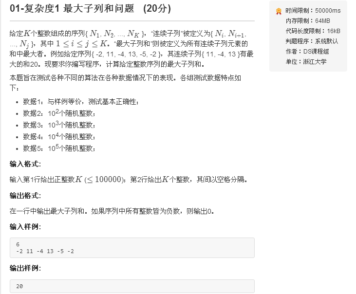

# 题目


# 代码

```golang
package main

import (
	"fmt"
)

func main() {
    var n int = 0
	fmt.Scanf("%d\n", &n)
	s := make([]int, n)
	for i := 0; i < n; i++ {
		fmt.Scanf("%d", &s[i])
	}
	fmt.Println(maxSubSeqSum(s[:]))
}

func maxSubSeqSum(seq []int) int {
	size := len(seq)
	maxSum := 0
	nowSum := 0
	for i := 0; i < size; i++ {
		nowSum = nowSum + seq[i]
		if nowSum > maxSum {
			maxSum = nowSum
		} else if nowSum < 0 {
			nowSum = 0
		}
	}
	return maxSum
}
```
